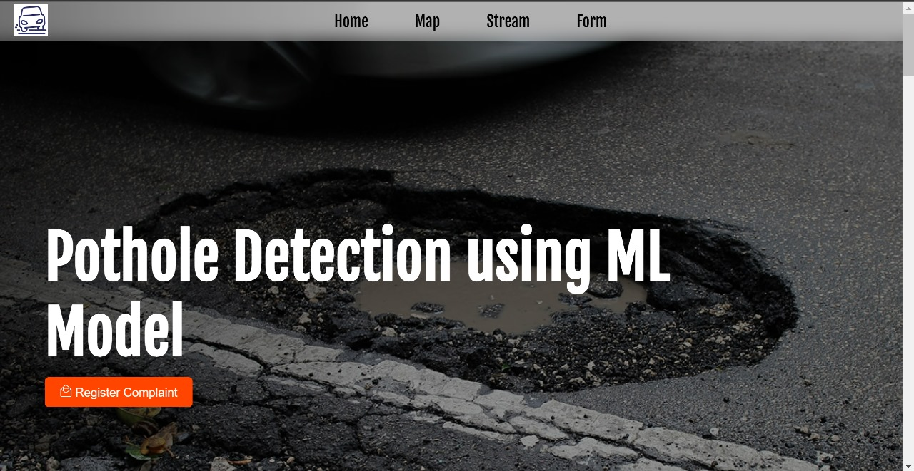
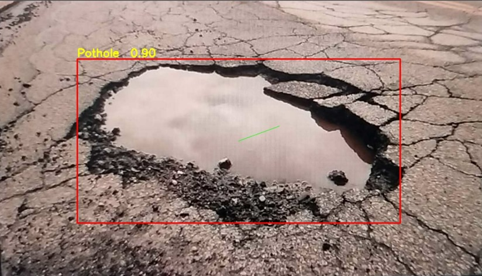
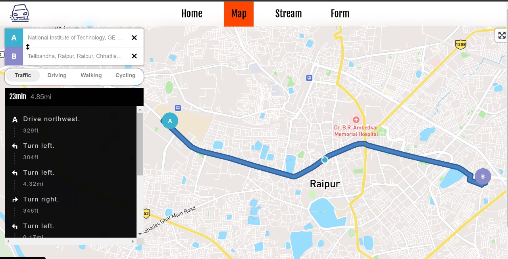

<h1 align="center" id="title">Realtime Pothole Complaints</h1>



It is a software product for detection of potholes and marking them on the map for the goverment to view and take actions on. 




The website consists of a complaint page where you can provide details and image of the pothole with your location.

We also have a section where you can provide the a video or IP address of your webcam to capture a video. 
 
When the potholes are detcted, the pictures of the pothole are stored in the database with the location. Using the images we calculate the volume and a 3d model of the pothole for better understanding of the problem with all other details. You can view this details by clicking on the pointer in the map.

<h2>Instructions to run the project locally.</h2>

Git clone the project locally and follow the instructions below. Do have docker installed in your system.

```bash
docker-compose build
```

```bash
docker-compose up
```

To stop the running container
```bash
docker-compose down
```

Go to [Main_page](http://localhost:5173/) to access the website.

Here is a video demonstration of our project

https://github.com/praveen-p09/accio-devs/assets/116294361/b2095ecc-7c36-4407-bc27-1887679f56b5
